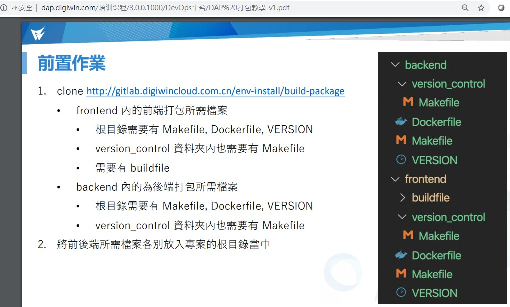

# 打包Web前置作業

[TOC]


# 平台版本

> 詳細說明請先參考DevOps平台培訓課程：
>
> http://dap.digiwin.com/assets/e-learning/CLD.html

適用DevOps平台版本Ver. 3.0.0 或以上


## 運維者門戶使用手冊_v1




# 檔案初始化

> 如果專案的根目錄有存留v2.1.4(包含)之前的打包工具資料夾 `dockerfile/` ，請先刪除才能使用新版打包方式。

請從DevOps 提供的 Git取得檔案放入前端專案中，或者也可以在前端專案的 `projects/webdpt/docker-ci/env-install/` 取得上述檔案。

```
.
|-- buildfile/
|-- version_control/
|-- Dockerfile
|-- Makefile
|-- VERSION
```


# 設定

> 請依照DevOps文件設定

下列以應用sampleApp1為範例


## VERSION

在此設定應用版本號

```
1.0.0
```


## Makefile

APP_ID 和 APP_NAME 請遵照DevOps文件說明，不可設定英文大寫或特殊符號。

```makefile
## app id
APP_ID=sampleapp1
## app 名稱
APP_NAME=sampleapp1
## 平台版本
PLATFORM_VERSION=3.0.0
## dap 平台類別，前端就是 frontend, 後端就是 backend
DAP_TYPE=frontend
## registry 位置
DOCKER_REGISTRY_URL=registry.digiwincloud.com
```


## Dockerfile

請依照開發手冊設定對應的Node.js版本

```dockerfile
# 安裝相依套件
FROM        node:10.13.0 AS build_base
```


maintainer設定存放於registry的應用團隊名稱

```dockerfile
LABEL       maintainer="DAP Demo產品中心"
```

